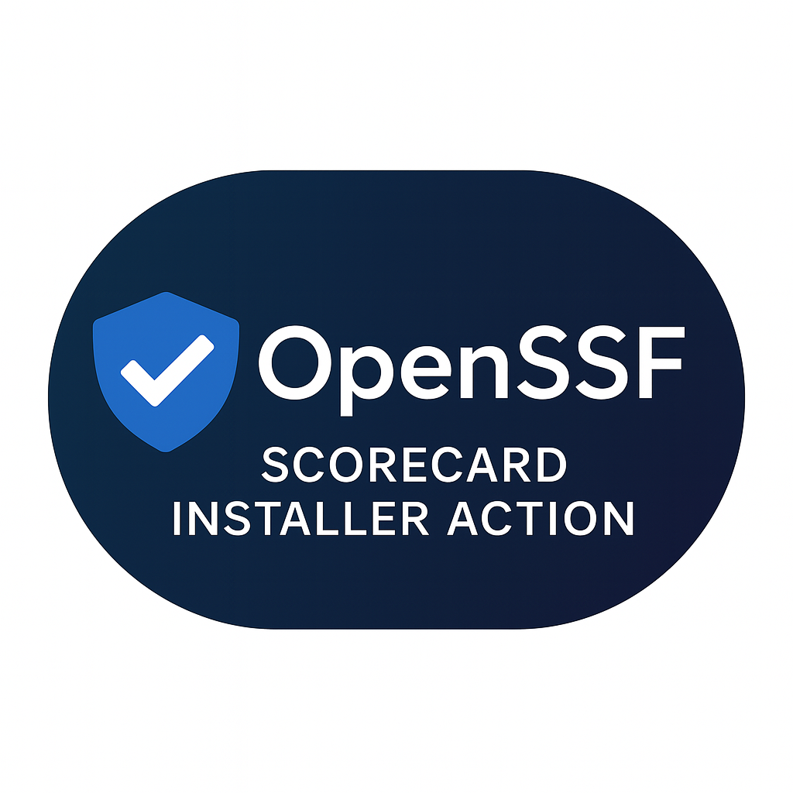

<div align="center">
  <div style="background: linear-gradient(135deg, #1a2980 0%, #26d0ce 100%); padding: 20px; border-radius: 15px; margin-bottom: 30px;">
    
    <h1 style="color: white; font-size: 36px; margin: 15px 0 5px;">OpenSSF Scorecard Installer Action</h1>
    <p style="color: #f0f0f0; font-size: 16px;">Automate security scoring for your GitHub repositories</p>
  </div>
  
  <div style="display: flex; flex-wrap: wrap; justify-content: center; gap: 10px; margin-bottom: 20px;">
    <a href="https://securityscorecards.dev/viewer/?uri=github.com/tbowman01/scorecard-installer-action" style="text-decoration: none;">
      
    </a>
    
    
  </div>

  <div style="display: flex; flex-wrap: wrap; justify-content: center; gap: 8px; margin-bottom: 40px;">
    
    
    
    
    
  </div>

  <div style="display: inline-block; background-color: #f8f9fa; padding: 10px 20px; border-radius: 8px; border-left: 4px solid #4CAF50; margin-bottom: 30px;">
    <h2 style="margin: 0; color: #333;">🚀 Quick Start</h2>
    <p style="color: #000000; font-weight: bold;">See <a href="YOLO-README.md" style="text-decoration: none; color: #4CAF50; font-weight: bold;">YOLO-README.md </a>for the fastest way to get started</p>
  </div>
</div>


## 🚀 What It Does

This GitHub Action installs the [OpenSSF Scorecard](https://github.com/ossf/scorecard) workflow and badge into a target repository. It automates:

* Adding the Scorecard GitHub Action workflow to `.github/workflows/scorecards.yml`
* Injecting the OpenSSF badge into the top of `README.md`
* Creating a pull request with the changes (unless `dry_run` is enabled)

---

## 📦 Usage

```yaml
name: Install OpenSSF Scorecard

on:
  workflow_dispatch:

jobs:
  install-scorecard:
    runs-on: ubuntu-latest
    steps:
      - name: Use Scorecard Installer
        uses: ./.github/actions/scorecard-installer
        with:
          repo_url: https://github.com/YOUR_ORG/YOUR_REPO
          branch: main
          github_token: ${{ secrets.GITHUB_TOKEN }}
          dry_run: false
          cron: "15 14 * * 5"
```

---

## 🎛 Inputs

| Name           | Required | Default         | Description                                      |
| -------------- | -------- | --------------- | ------------------------------------------------ |
| `repo_url`     | ✅ Yes    | —               | URL of the target GitHub repository              |
| `branch`       | ❌ No     | `main`          | Branch to base the PR from                       |
| `github_token` | ✅ Yes    | —               | Token with `repo` and `workflow` scopes          |
| `dry_run`      | ❌ No     | `false`         | If `true`, simulates changes without creating PR |
| `cron`         | ❌ No     | `'15 14 * * 5'` | Custom cron for the scheduled Scorecard scan     |

---


---

## 🧪 Test Locally with `act`

```bash
act -j install-scorecard
```

### 🔧 How to Install `act`

If `act` is not already installed, follow these steps:

**For macOS (Homebrew):**

```bash
brew install act
```

**For Linux:**

```bash
curl -s https://raw.githubusercontent.com/nektos/act/master/install.sh | sudo bash
```

**For Windows (Scoop):**

```powershell
scoop install act
```

Or download from the [releases page](https://github.com/nektos/act/releases) and place it in your system's PATH.

---

## 📌 Notes

* Requires a GitHub token with write access to the target repo
* Will skip PR creation if no changes are detected
* Can be reused in org-wide workflows

---

## 📥 Coming Soon

* GitHub Marketplace listing
* Scorecard dashboard link
* Multi-repo install orchestrator

---

## 👤 Author

**Trevor Bowman** — [github.com/tbowman01](https://github.com/tbowman01)
